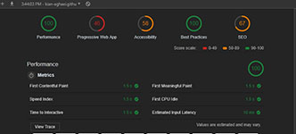

### Table of Contents
-  [Introduction](#Introduction)
-  [Specification](#Specification)
-  [JavaScript Documentation](#JavaScript-Documentation)
-  [Bug Fixing](#Bug-fixing)
-  [Best Practice and Performance Improvement](#Best-Practice-and-Performance-Improvement)
-  [Testing](#Testing)
-  [Audit](#Audit)
-  [Competitor's Comparison](#Competitor's-Comparison)
-  [Summary](#Summary)


----
## Introduction
This web app is a simple to-do list application which could store user tasks. It also can add, removes, updates and toggles between states of tasks. Because of the minimalistic design of it, it has a fast and simple interface to work with.

The application is developed according to the "MVC" (Model-View-Controller) pattern. Basically, this method contains three major part. The model which is responsible to structure the data in a reliable form and prepares it based on the controller’s instructions. The view which displays data to the user in an easy-to-understand format, based on the user’s actions and finally the Controller that takes in user commands, sends commands to the model for data updates and sends instructions to view to update interface. Using MVC gives us lots of flexibility to maintain and good opportunity to expand the application in future much faster and easier but on the other hand, it adds up a bit more complexity to the code structure in general.

You can test its functionality here:
*[todo-list-app](https://kian-aghaei.github.io/Project8/)* 
and also visit its repository *[here!](https://github.com/Kian-Aghaei/Project8)*

----
## Specification
This application is written by the use of three major tools/languages of front-end development. HTML/CSS/JavaScript. Besides recently added “uuid” library, this app is developed with pure JavaScript (Vanilla JS) with the help of no forms of external libraries or frameworks.

#### *HTML*:
 There is only one HTML file in the project (index.html) which is the entry point to the app.
   
#### *CSS*:
There is one active CSS file (index.css) as part of a npm module (todomvc-app-css). Another CSS file also resides in the project (base.css) which is not functional due to the removal of some part of the original HTML file (sidebar). 

#### *JavaScript*:
There are 7 main JavaScript files in the project :
 - **store.js**: Simply create a new client-side storage object (with window.localStorage) in order to store the tasks and their states.
 - **template.js**: Acts as a substitute to templating engines (like Mustache or Handlebars) and delivers functions such as listing items and changing button states.
 - **helper.js**: It delivers functions in order to facilitate interactions between DOM and JS such as selecting elements and attaching handlers to specific elements.
 - **model.js**: Creates a new Model instance based on the MVC concept and hooks up the storage in order to give the access of it to the Controller.
 - **view.js**: It wraps around the DOM and provides users with two major functionalities. First taking a todo application event and registers the handler and second, renders the page based on the given command with the correct data and options.
 - **controller.js**: It takes both model and view instances and acts as the controller between them.
 - **app.js**: It creates a new instance of the app itself by initializing the model, view, and controller.

----
## JavaScript Documentation
To learn more about the inner mechanism of JavaScript in this app, you can check this *[Page](https://8th-project-of-oc.readthedocs.io/en/latest/)* for detail. This JS Documentation was created automatically by the use of *JSDoc* and *Documentation.js* with some manual modification. 

----
## Bug Fixing
During the program’s manual test three bugs have been found. One of them was a simple typo, the other was the potential possibility of assigning an identical ID to two different entities on DB, and the last was a missing id of an input tag.
 - In *controller.js*:
 
    <code>Controller.prototype.adddItem</code>
    
    replaced with:
    
    <code>Controller.prototype.addItem</code>
    
 - In *store.js*:
 
    Faulty ID generation process:
    
    ```javascript
    var newId = "";
    var charset = "0123456789";
    for (var i = 0; i < 6; i++) {
        newId += charset.charAt(Math.floor(Math.random() * charset.length));
    }
          
    updateData.id = parseInt(newId);
    ```
    replaced with the use of “uuid” module in order to generate unique ID for each entry in DB:
    ```javascript
    // Generate a new ID
    updateData.id = uuid();
    ```
    In order to make the use of new type of ID through the program correctly, there were some necessary changes in both *[view.js](https://github.com/Kian-Aghaei/Project8/commit/ae3e9548ca885081447daa9b0ee682ab01f17dca)*
    and *[model.js](https://github.com/Kian-Aghaei/Project8/commit/7dbbe1277f356ea2749ccf13087fdecdd852ca3f)* files.
    
 - In *index.html*:
 
    There was a missing id for an "input" tag so this line of code:
    ```html
    <input class="toggle-all" type="checkbox">
    ```
    replaced with:
  
   ```html
    <input class="toggle-all" id="toggle-all" type="checkbox">
   ```
----
## Best Practice and Performance Improvement
There were some parts of code which have been modified to improve its performance.
- In *store.js*:

    In order to remove redundant piece of code and unnecessary loop this method:
     ```javascript
     Store.prototype.remove = function (id, callback) {
        var data = JSON.parse(localStorage[this._dbName]);
        var todos = data.todos;
        var todoId;
        
        for (var i = 0; i < todos.length; i++) {
           if (todos[i].id == id) {
              todoId = todos[i].id;
           }
        }
     
        for (var i = 0; i < todos.length; i++) {
           if (todos[i].id == todoId) {
              todos.splice(i, 1);
           }
        }
     
        localStorage[this._dbName] = JSON.stringify(data);
        callback.call(this, todos);
     };
    ```
    replaced with:
    ```javascript
    Store.prototype.remove = function (id, callback) {
       var data = JSON.parse(localStorage.getItem(this._dbName));
       var todos = data.todos;
    
       for (var i = 0; i < todos.length; i++) {
          if (todos[i].id === id) {
             todos.splice(i, 1);
             break;
          }
       }
    
       localStorage.setItem(this._dbName, JSON.stringify(data));
       callback.call(this, todos);
    };
    ```
    And also all the bracket notation use of “localStorage” object replaced with proper default method of it (<code>setItem()</code> or <code>getItem()</code>).
    
    For example:
    ```javascript
    var data = JSON.parse(localStorage[this._dbName]);
    ```
    replaced with
    ```javascript
    var data = JSON.parse(localStorage.getItem(this._dbName));
    ```
    In controllerSpec.js, in one of the specs (“should add a new todo to the view”) there were two unnecessary reset call on two of spies which have been removed:
    ```javascript
    view.render.calls.reset();
    model.read.calls.reset();
    ```
----    
## Testing
For testing the different functionalities of the app we have used a testing framework, Jasmine. Some tests should have been added to the already written ones based on previously stablished premise. Here is the list of Specs which new tests were written to meet the expectations.
1.	should show entries on start-up
2.	should show active entries
3.	should show completed entries
4.	should highlight "All" filter by default
5.	should highlight "Active" filter when switching to active view
6.	should toggle all todos to completed
7.	should update the view
8.	should add a new todo to the model
9.	should remove an entry from the model

----
## Audit
>Audits were performed using *Google Chrome*'s DevTools (Version 72.0 - 64-bit) on *Windows 10* machine.

Regarding todolistme.net (competitor website) performance, we have three resources which block the rendering process. The method which we access to those resources could be modified in a way that improves our app's performance. In this case, we can use "Web Font Loader" to load the fonts and also implement requests to stylesheet resources - like JQUERY library - in an asynchronous way. Improving this aspect could save us almost 640ms according to lighthouse audit report and makes it Achilles heel of this app's performance.

[](./img/audit-overview.jpg) | [](./img/chrome-dev-description1.jpg)
---|---
[](./img/chrome-dev-description2.jpg) | [](./img/web-dev-overview.jpg)

One of the other major performance issues is regarding images which are being loaded into the web app. Almost all of the images which are being served as icons in this app, have PNG format. By changing these images format into formats like JPEG 2000, JPEG XR or WebP we could reduce the size of them and so decrease app's loading time. According to cloudinary.com report potentially by format changing we can decrease the overall size of the images from 13KB to 3.5KB and based on the lighthouse audit report, it saves us almost 750ms in loading time. Also since most of the images are serving as icons we have the option to use "CSS sprite" technique to combine all of them into one single file which loads once and then we can use it multiple times.

[](./img/image-analysis.jpg)

Besides increasing the loading time, large CSS files lead to the need of more time for the browser to spend in order to construct the render tree. In this case, we have many unused CSS rules based on information provided by Coverage tab in chrome dev tool. So one of the options in this specific performance issue is to detect critical CSS rules and then inlining them and also removing unused CSS rules as well. Based on the lighthouse audit report it could save us almost 150ms during loading time span.

[](./img/coverage-tab.jpg)

There are two other noticeable performance issues, which we can make them disappear first by using the minified version of Jquery JS files in order to reduce file size and loading time, and then by implementing "preconnect" link to external resources to save time as well. According to the lighthouse audit report by doing so we potentially could decrease loading time by 330ms and 300ms respectively.

Another way of improving this app's performance is by applying cache policy to static assets. In this case there are many files mostly with PNG format which are being requested from the server every time the user requests the app itself. By using cache policy, we could tell the browser to cache our static content like images for a specific and also reasonable amount of time in order to decrease traffic exchange and also improve loading time. 

We may also reduce the time spent parsing, compiling, and executing JS in this app by delivering smaller JS payloads to decrease the current time of these steps from 3200ms to less than that.By doing all of the above solutions we can decrease the time of showing first meaningful content, speed index and also the time which app would be available fully interactive to the user.

Regarding resource consumption of todolistme.net, we can safely say that based on a rough estimate and according to “webpagetest.org” result, almost 338KB or 23% of the loaded data are related to the Ads and 76KB or 5% are related to analytics. On a different point of view, almost 62% of the whole data is JS content which most of it is the result of loading Jquery library into the app and 22% of it is the images both Ads and the app images.

[](./img/statistic.jpg) | [](./img/ads.jpg)
---|---
[](./img/memory-usage.jpg) | 

In comparison, our todo-list-app (which is being hosted on *[Github Pages](https://pages.github.com/)* for the purpose of audit tests), is a light and fast app which loads without any sorts of medias, images or videos and it has a better performance in terms of loading speed and time to interactive. But in future and if we are going to improve or expand our own app, there are lots of modification which we could do in terms of accessibility and PWA.

[](./img/todolist-overview.jpg)  [](./img/todolist-network.jpg)


----
## Competitor's Comparison
In final comparison between the two we can observe the major difference:

&nbsp; | todolistme.net | Our App
--|--|--
Transferred: | **11017 KB** | **3005 KB**
DOM Content loads: | **1260ms** | **562ms**
Page loads in: | **3630ms** | **696ms**

[](./img/todolist-loading-time.jpg) | [](./img/competitor-loading-time.jpg)
---|---
[](./img/todolist-sizde.jpg) | [](./img/competitor-size.jpg)

----
## Summary
Our app performs in a way more efficient way than the competitor, but on the other hand competitor app has more useful functionalities and provides a much sophisticated interface. Loading time and general performance increased, instead of adding better functionality and user experience to the competitors app.

[ Kian Aghaei  &copy;](https://github.com/Kian-Aghaei)
